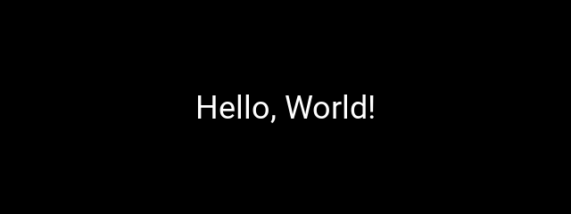

# #820 kvlang

Analizzare kvlang e mostrare una Label con il saluto.

## Verifica reale

Kivy 2.3.1; CPython 3.12.3; Xvfb; Mesa software GL

```text
pip install Kivy==2.3.1; xvfb-run -a python verify_render.py; aprire verification/rendered.png. Con un display attivo usare python verify_render.py.
```

Risultato atteso: Hello, World!

**Sintassi e semantica verificate.** Builder.load_file crea la Label autentica e l’event loop Kivy ne renderizza la texture 202x43 nella finestra SDL2. Screenshot nativo e ispezione visiva confermano Hello, World!. Il provider opzionale multitouch MTDev non è disponibile; il rendering e la cattura superano la prova con exit 0.

[Log della prova](verification/render.json). La precedente prova sintattica resta in [result.json](verification/result.json).



## Fonti primarie

- [https://kivy.org/doc/stable/api-kivy.lang.html](https://kivy.org/doc/stable/api-kivy.lang.html)
- [https://kivy.org/doc/stable/guide/lang.html](https://kivy.org/doc/stable/guide/lang.html)
- [https://kivy.org/doc/stable/api-kivy.core.window.html](https://kivy.org/doc/stable/api-kivy.core.window.html)

## Copertura delle estensioni

Ogni suffisso mantiene la propria prova; le varianti pendenti non ereditano le verifiche.

| Estensione | File e stato |
| --- | --- |
| `.kv` | [hello.kv](hello.kv) sintassi e semantica verificate |
